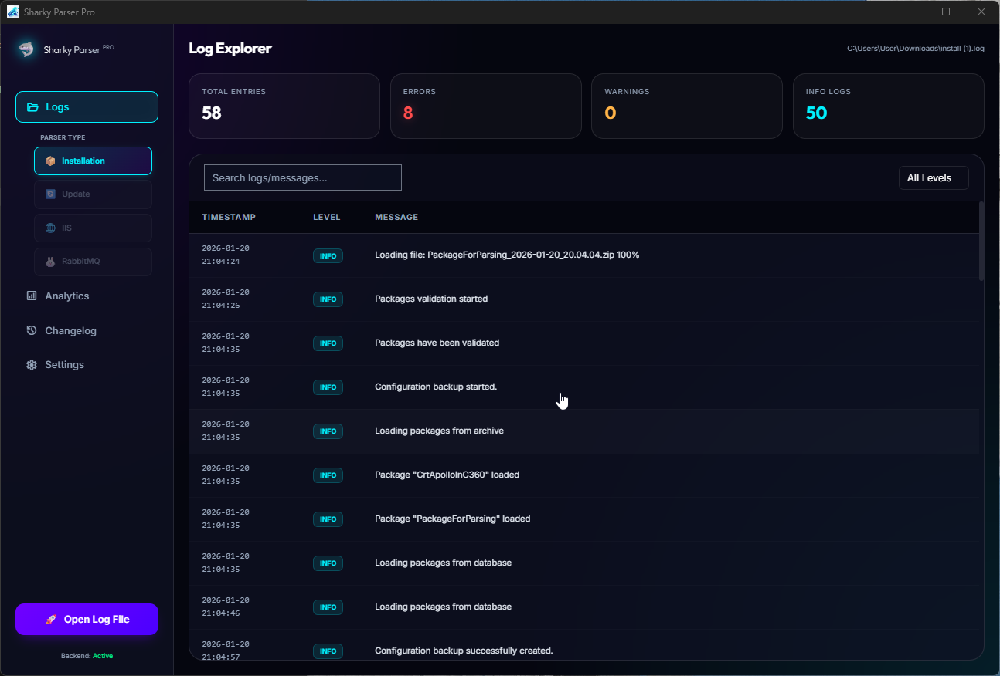
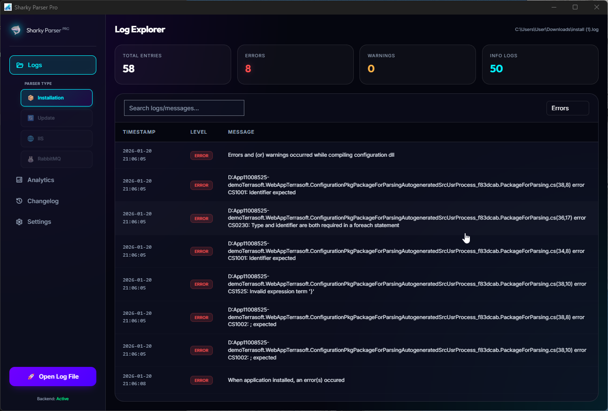
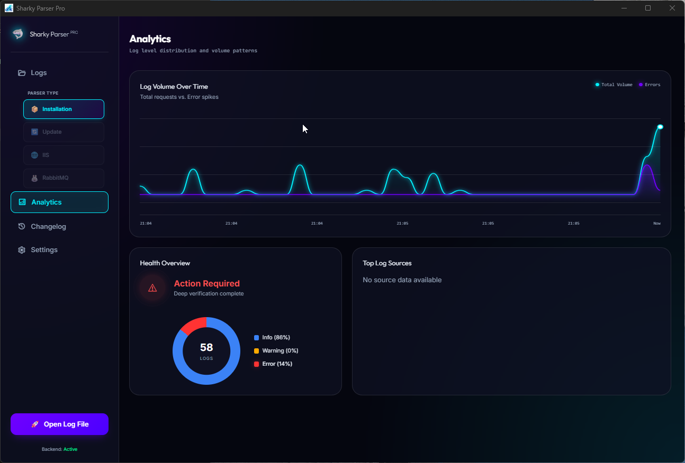
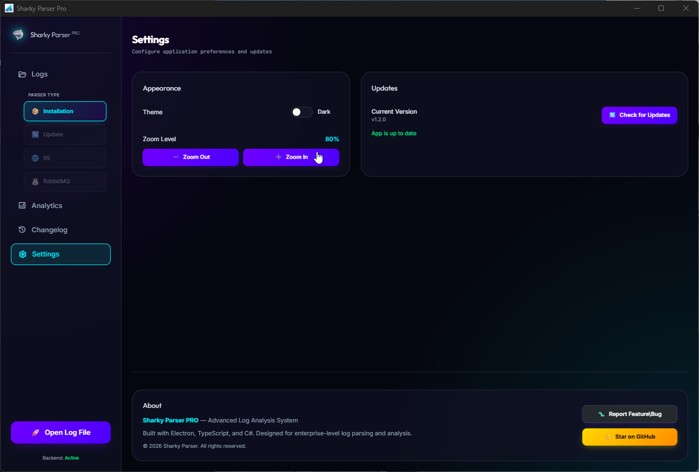
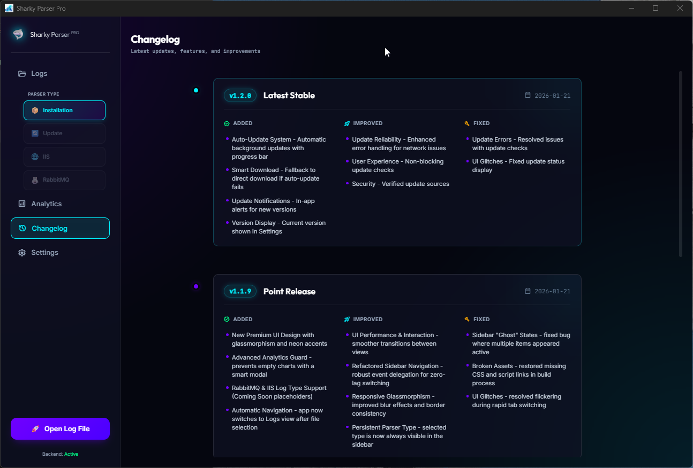

# Sharky Parser PRO 🦈


[](https://github.com/BlessedDayss/SharkyParser/releases)
[](https://opensource.org/licenses/MIT)

**Sharky Parser PRO** is a high-performance, cross-platform log management suite designed for developers and DevOps engineers. It combines the raw power of a **.NET 8** backend with the sleek, modern experience of an **Electron** frontend.

<p align="center">
  
</p>

---

## 📸 visual Overview

### 🔍 Log Exploration & Error Tracking
Categorize and navigate through thousands of logs with ease.
<p align="center">
  
  
</p>

### 📊 Advanced Analytics
Visualize log patterns and system health spikes in real-time.
<p align="center">
  
</p>

### 🛠️ Modern Settings & History
Full control over themes and a professional changelog experience.
<p align="center">
  
  
</p>

---

## ✨ Key Features

### 🖥️ Modern Desktop Client (Electron + Vite)
- **Glassmorphic UI**: A stunning, high-contrast dark/light interface with fluid animations.
- **Smooth Zoom Control**: Intuitive scaling using `Ctrl + Mouse Wheel` or professional `+/-` buttons with built-in throttle protection.
- **Smart Analysis Dashboard**: Visualize your system's health with automated distribution charts and health pulses.
- **Tabbed Log Details**: Seamlessly toggle between "Message" and "Stack Trace" views in entries.
- **Smart Update Mechanism**: Native fallback download system that bypasses metadata errors and handles redirects automatically.

### ⚙️ High-Performance Core (.NET 8)
- **Intelligent Parsing Engine**: Supports multiline messages, complex stack traces, and automatic log level detection.
- **Broad Compatibility**: Specialized parsers for:
  - 🛠️ **Installation Logs** (with support for varied timestamp formats)
  - 🌐 **IIS Logs** (Under development)
  - 🐇 **RabbitMQ Logs** (Under development)
  - 🔄 **Update Logs**

### ⌨️ Command Line Interface (CLI)
- **Table Mode**: Beautifully rendered ASCII tables for quick terminal inspection.
- **Embedded Mode**: High-speed pipe-delimited output for integration with other tools.
- **Health Analysis**: Quick metrics (`Total`, `Errors`, `Warnings`) at a glance.

---

## 🚀 Quick Start

### For Users

1.  Download the latest installer from the [Releases](https://github.com/BlessedDayss/SharkyParser/releases) page.
2.  Install and launch **SharkyParser**.
3.  Open any installation log file (e.g., `install.log`) and let Sharky do the work.

### For Developers

#### Prerequisites
- [.NET 8 SDK](https://dotnet.microsoft.com/download/dotnet/8.0)
- [Node.js 20+](https://nodejs.org/)

#### 1. Setup Backend
```bash
# Build the core CLI
cd SharkyParser.Cli
dotnet build -c Release
```

#### 2. Run Desktop UI
```bash
cd SharkyParser.Ui
npm install
npm run dev
```

#### 3. CLI Usage
```bash
# Global installation (optional)
dotnet tool install -g SharkyParser

# Basic Parsing
sharky parse "C:\path\to\log.txt" --type Installation
```

---

## 🛠️ Architecture

Sharky Parser is built on a "Decoupled Hybrid" architecture:
- **Backend**: C# (.NET 8) handles the heavy lifting of regex parsing, file I/O, and data processing.
- **Frontend**: TypeScript + Vite + Electron provides a responsive UI, interacting with the backend via a fast subprocess bridge.
- **IPC Layer**: Secure communication between the UI and the system, supporting file dialogs, system scaling, and auto-updates.

---

## 🤝 Contributing

Contributions are welcome! Please feel free to submit a Pull Request.
1. Fork the Project.
2. Create your Feature Branch (`git checkout -b feature/AmazingFeature`).
3. Commit your Changes (`git commit -m 'Add some AmazingFeature'`).
4. Push to the Branch (`git push origin feature/AmazingFeature`).
5. Open a Pull Request.

---

## 📄 License

Distributed under the **MIT License**. See `LICENSE` for more information.

---

**Sharky Parser** - *Bite through your logs with style.* 🦈
